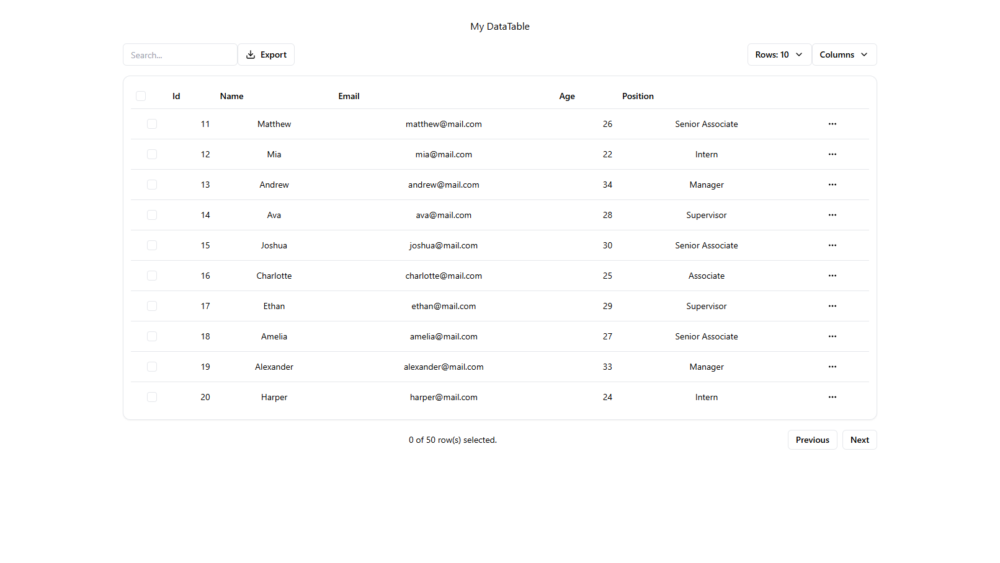

# React DataTable Guidelines

## Overview
A comprehensive guide for using and contributing to the React DataTable component library.


## Installation
```bash
npm i @phaneth_pho/react-datatable
```

## Install tailwind css

```bash

npm install tailwindcss @tailwindcss/vite

```

## update your vite.config.ts

```bash
vite.config.ts

import { defineConfig } from 'vite'
import tailwindcss from '@tailwindcss/vite'
export default defineConfig({
  plugins: [
    tailwindcss(),
  ],
})
```

## update your index.css everything 

```bash
index.css

@import "tailwindcss";
```

## Basic Usage
```jsx
import {DataTable} from '@phaneth_pho/react-datatable'
import "@phaneth_pho/react-datatable/dist/styles.css";

function App() {
  return <DataTable data={data} />;
}
```

## Features
- Sortable columns
- Pagination support
- Responsive design
- Header and body rendering by data[] array object automaticaly
- Columns show/hide functionality
- Search functionality
- Export functionality
- Select row functionality
- Support tailwind css v4

## Configuration
| Option | Type | Description |
|--------|------|-------------|
| `data` | Array | Table data source |
| `columns` | Array | Column definitions |
| `paginated` | Boolean | Enable pagination |
| `sortable` | Boolean | Enable sorting |

## API Reference
- `DataTable` - Main component
- `useDataTable()` - Hook for table state

## Contributing
See CONTRIBUTING.md for guidelines.

## License
MIT

## sample usage

```bash

//src/App.jsx

import React from "react";
import { DataTable } from "@phaneth_pho/react-datatable"; // your library
import "@phaneth_pho/react-datatable/dist/styles.css";    // library CSS


const data = [
  { id: 1, name: "John", email: "john@mail.com", age: 25, position: "Manager" },
  { id: 2, name: "Sara", email: "sara@mail.com", age: 30, position: "Supervisor" },
  { id: 3, name: "Mike", email: "mike@mail.com", age: 22, position: "Senior Associate" }
];

export default function App() {
  return (
    <div>
      <h1>React DataTable Test</h1>
      <Datatable
        loading={isLoading} //enabled spinner loading on event
        data={users} //asigned data to datatable
        onDetails={handleDetails} //details fuction callback
        onDelete={handleDelete} //delete function callback
        onEdit={handleEdit} //edit function callback
        onSelected={handleSelected} //enable selected rows
        onExport={true} //enable export button
        onSearch={true} //enable search box
        onColumn={true} //enable show/hide column table
      />
    </div>
  );
}

```

## functionality

```bash

//all functions below required paramater response back with data

  const handleDetails = async (data) => {
    //your statement
  }

  const handleEdit = async(data)=> {
    //your statement
  }

  const handleDelete = async(data)=>{
    //your statement
  }

  const handleSelected = async(data)=>{
    //your statement 
  }

```
## sample datatable

```bash
      <Datatable
        loading={isLoading} #enabled spinner loading on event
        data={users} #asigned data to datatable
      />

```

## start vite server Vite dev server:

```bash
npm run dev

```